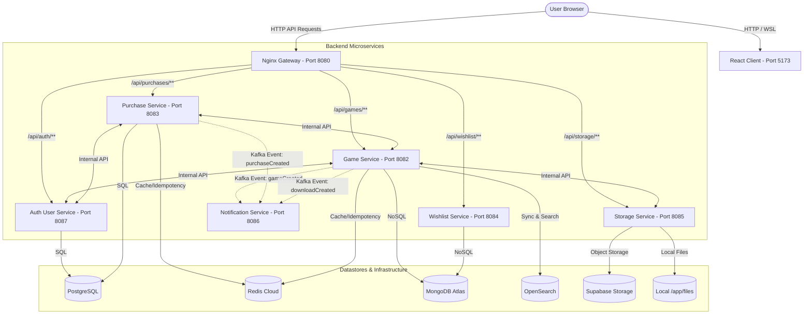

# 🎮 GameSpotlight

GameSpotlight is a modern, high-performance web storefront for exploring, reviewing, and downloading games. The project is built using a **Microservices Architecture** with a **Spring Boot** backend ecosystem, an **Nginx Gateway** reverse proxy, and a **React + Vite** frontend client.

---

## 🏗️ Architecture & Component Overview

GameSpotlight is split into a modular frontend and containerized, specialized backend microservices:



### Microservices Summary

| Service | Port | Database / Middleware | Primary Responsibility |
| :--- | :---: | :--- | :--- |
| **Nginx Gateway** | `8080` | None (Nginx Reverse Proxy) | Dynamic routing of API routes, SSL termination, and client abstraction. |
| **React Client** | `5173` | Local Storage | Modern catalog UI built with Vite, Tailwind CSS, and Supabase integration. |
| **Auth User Service** | `8087` | PostgreSQL | User registrations, credential authentication, user profiles, and JWT generation. |
| **Game Service** | `8082` | MongoDB, Redis, OpenSearch | Game metadata catalogue, OpenSearch synchronization, user reviews, and statistics. |
| **Purchase Service** | `8083` | PostgreSQL, Redis | Idempotent transaction processing, purchase state logs, and invoice email triggers. |
| **Storage Service** | `8085` | Local Disk / Supabase | Game asset handling (cover/gallery images to public URLs, private file downloads). |
| **Wishlist Service** | `8084` | MongoDB | Store and manage user-specific wishlist game records. |
| **Notification Service**| `8086` | None (Kafka + Brevo SMTP) | Async worker consuming Kafka event topics (`game.created`, `game.purchases`) to send email notifications. |

---

## 📁 Repository Structure

```
Game-SpotLight/
├── client/                 # React UI + Vite + Tailwind CSS storefront
├── services/               # Microservices root directory
│   ├── auth-user-service/  # User & Authentication service (Spring Boot)
│   ├── game-service/       # Game directory and catalog service (Spring Boot)
│   ├── purchase-service/   # Billing and purchases service (Spring Boot)
│   ├── wishlist-service/   # Wishlist service (Spring Boot)
│   ├── storage-service/    # Asset file & Image storage service (Spring Boot)
│   ├── notification-service/# Kafka mail alerts service (Spring Boot)
│   ├── nginx/              # Nginx Gateway reverse proxy configuration
│   ├── storage-files/      # Local volume binding for file storage testing
│   └── docker-compose.yml  # Local orchestrator for developing multi-service flows
├── envs/                   # Pre-defined environment variable examples
├── scripts/                # Verification utilities (e.g. pre-commit hooks, end-to-end event tests)
├── MIGRATIONS.md           # Instructions on databases and manual Flyway schema changes
├── SECRETS.md              # Instructions for secure environment variables setup
└── TODO.md                 # Current roadmap and migration checkmarks
```

---

## ⚙️ Local Configuration & Security

To prevent leaking production secrets or API credentials, all microservices load configuration properties from environment variables or custom `.env` files.

> [!WARNING]
> Never commit `.env` files to Git. The pre-commit hook in `scripts/` will automatically block commits containing raw credentials.

### Setup Environment Files

Copy the provided environment templates and supply your own keys/connection URIs:

1. **Root Services Configuration**:
   ```bash
   cd services
   cp .env.example .env
   ```
2. **Individual Service Configurations**:
   ```bash
   cp auth-user-service/.env.example auth-user-service/.env
   cp game-service/.env.example game-service/.env
   cp purchase-service/.env.example purchase-service/.env
   cp storage-service/.env.example storage-service/.env
   cp wishlist-service/.env.example wishlist-service/.env
   cp notification-service/.env.example notification-service/.env
   ```

3. **Required Credentials**:
   Refer to [SECRETS.md](file:///c:/Users/YUG/OneDrive/Documents/Desktop/gm2/Game-SpotLight/SECRETS.md) for generating:
   - **PostgreSQL JDBC URLs** (for Auth and Purchase)
   - **MongoDB Atlas Connection Strings** (for Game, Wishlist, Storage)
   - **JWT Secret** (shared, generate using `openssl rand -base64 32`)
   - **Kafka (Aiven)** and **Redis** connection keys
   - **Supabase credentials** (Storage URLs + role keys)

---

## 🚀 Running GameSpotlight Locally

### The Recommended Way: Docker Compose

Docker Compose builds all services and runs them in a unified network. The React UI is launched inside the container, proxying backends automatically.

1. Ensure Docker Desktop is running.
2. From the `services/` directory, launch the services:
   ```bash
   cd services
   docker compose up --build
   ```
3. Once running, open:
   - **Frontend application**: `http://localhost:5173`
   - **Nginx API gateway root**: `http://localhost:8080/api`

### Alternative: Running Services Manually (Bare Metal)

If you are developing a single service, you can run it via Maven. For example, to run the **Game Service**:

```powershell
cd services/game-service
mvn spring-boot:run
```

And for the **Frontend**:
```powershell
cd client
npm install
npm run dev
```

---

## 🔬 Testing & Verification

### 🛡️ Pre-commit Security Hook Setup
To ensure you do not commit raw passwords or tokens:
```powershell
# Set up hooks configuration
git config core.hooksPath .git/hooks

# Copy Hook script (Windows)
New-Item -ItemType Directory -Path .git/hooks -Force | Out-Null
Copy-Item scripts/pre-commit-hook.ps1 -Destination .git/hooks/pre-commit
```
*(Refer to [PRE-COMMIT-SETUP.md](file:///c:/Users/YUG/OneDrive/Documents/Desktop/gm2/Game-SpotLight/scripts/PRE-COMMIT-SETUP.md) for macOS/Linux commands).*

### 📨 Kafka Event Flow E2E Test
The event-driven pipelines (Purchase events $\rightarrow$ email notifications $\rightarrow$ idempotent MongoDB/OpenSearch updates) can be simulated using:
```powershell
# Execute the testing script
.\scripts\kafka_e2e_test.ps1
```

### ☕ Running Service Tests
Each service includes Unit and Integration Tests (IT). Run tests inside a service folder using Maven:
```bash
mvn test
```
